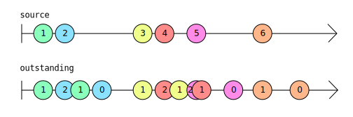
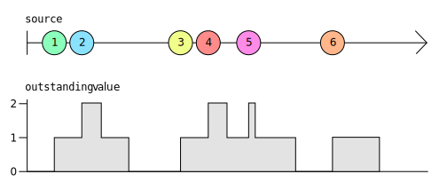
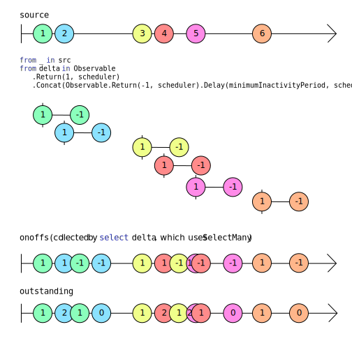

# Key types

Rx is a powerful framework that can greatly simplify code that response to events. But to write good Reactive code you have to understand the basic concepts.

The fundamental building block of Rx is an interface called `IObservable<T>`. Understanding this, and its counterpart `IObserver<T>`, is the key to success with Rx. This chapter will also describe a family of types called _subjects_, which implement both `IObserver<T>` and `IObservable<T>`. Although subjects are not quite as important as the two fundamental types, they can be very helpful when using Rx, and can sometimes provide an easy way in for developers new to Rx.

Most .NET developers will be familiar with [LINQ](https://learn.microsoft.com/en-us/dotnet/csharp/programming-guide/concepts/linq/basic-linq-query-operations) in at least one of its many popular forms such as [LINQ to Objects](https://learn.microsoft.com/en-us/dotnet/csharp/programming-guide/concepts/linq/linq-to-objects), or [Entity Framework Core queries](https://learn.microsoft.com/en-us/ef/core/querying/). Most LINQ implementations allow you to query _data at rest_—LINQ to objects works on arrays or other collections; LINQ queries in Entity Framework Core run against data in a database. But Rx is different: it offers the ability to define queries over live event streams—what you might call _data in motion_.

The preceding chapter had this example:

```cs
var bigTrades =
    from trade in trades
    where trade.Volume > 1_000_000;
```

If you don't like the query expression syntax, you can write exactly equivalent code by invoking LINQ operators directly:

```cs
var bigTrades = trades.Where(trade => trade.Volume > 1_000_000);
```

Whichever style we use, this is the LINQ way of saying that we want `bigTrades` to have just those items in `trades` where the `Volume` property is greater than one million.

We can't tell exactly what these examples do because we can't see the type of the `trades` or `bigTrades` variables. The meaning of this code is going to vary greatly depending on these types. If we were using LINQ to objects, these would both likely be `IEnumerable<Trade>`. That would mean that these variables both referred to objects representing collections whose contents we could enumerate with a `foreach` loop. This would represent _data at rest_, data that our code could inspect directly.

But let's make it clear what the code means by being explicit about the type:

```cs
IObservable<Trade> bigTrades = trades.Where(trade => trade.Volume > 1_000_000);
```

This removes all ambiguity. It is now clear that we're not dealing with data at rest. We're working with an `IObservable<Trade>`. But what exactly is that?


## IObservable<T>
    
The [`IObservable<T>` interface](https://learn.microsoft.com/en-us/dotnet/api/system.iobservable-1 "IObservable<T> interface - Microsoft Learn") represents Rx's fundamental abstraction: a sequence of values of some type `T`. In a very abstract sense, this means it represents the same thing as `IEnumerable<T>`. The difference is in how code consumes those values. Whereas `IEnumerable<T>` enables code to retrieve values (typically with a `foreach` loop), an `IObservable<T>` provides values when they become available. This distinction is sometimes characterised as _push_ vs _pull_. We can _pull_ values out of an `IEnumerable<T>` by executing a `foreach` loop, but and `IObservable<T>` will _push_ values into our code.

How can an `IObservable<T>` push its values into our code? If we want these values, our code must _subscribe_ to the `IObservable<T>`, which means providing it with some methods it can invoke.

In fact, subscription is the only operation an `IObservable<T>` directly supports. Here's the entire definition of the interface:

```cs
public interface IObservable<out T>
{
    IDisposable Subscribe(IObserver<T> observer);
}
```

You can see [the source for `IObservable<T>` on GitHub](https://github.com/dotnet/runtime/blob/b4008aefaf8e3b262fbb764070ea1dd1abe7d97c/src/libraries/System.Private.CoreLib/src/System/IObservable.cs). Notice that it is part of the .NET runtime libraries, and not the `System.Reactive` NuGet package. `IObservable<T>` is of such fundamental importance that it is baked into .NET. (So you might be wondering what the `System.Reactive` NuGet package is for. The .NET runtime libraries define only the `IObservable<T>` and `IObserver<T>` interfaces, and not the LINQ implementation. The Rx NuGet package gives us LINQ support, and also deals with threading.)

Observant readers will have noticed that an example in the preceding chapter looks like it shouldn't work. Having created an `IObservable<long>` that produced events once per second, it subscribed to it with this code:

```cs
ticks.Subscribe(
    tick => Console.WriteLine($"Tick {tick}"));
```

That's passing a delegate, but we can see that `IObservable<T>.Subscribe` requires something called an `IObserver<T>`. We'll get to `IObserver<T>` shortly, but all that's happening here is that this example is using an extension method from the Rx NuGet package:

```cs
// From the System.Reactive library's ObservableExtensions class
public static IDisposable Subscribe<T>(this IObservable<T> source, Action<T> onNext)
```

This is a helper method that wraps a delegate in an implementation of `IObserver<T>` and then passes that to `IObservable<T>.Subscribe`. The effect is that we can write just a simple method (instead of a complete implementation of `IObserver<T>`) and the observable source will invoke our callback each time it wants to supply a value.

Since `IObservable<T>` defines just one method, `Subscribe`, you might be wondering how we can do anything interesting with it. The power comes from the LINQ operators that the `System.Reactive` NuGet library supplies.

### LINQ Operators and Composition

So far I've shown only a very simple LINQ example, using the `Where` operator to filter events down to ones that meet certain criteria. To give you a flavour of how we can build more advanced functionality through composition, I'm going to introduce an example scenario.

Suppose you want to write a program that watches some folder on a filesystem, and performs automatic processing any time something in that folder changes. For example, web developers often to trigger automatic rebuilds of their client side code when they save changes in the editor so they can quickly see the effect of their changes. Often in these cases, filesystem changes often come in bursts—text editors might perform a few distinct operations when saving a file. (Some save modifications to a new file, then perform a couple of renames once this is complete, because this avoids data loss if a power failure or system crash happens to occur at the moment you save the file.) So you typically won't want to take action as soon as you detect file activity. It would be better to give it a moment to see if any more activity occurs, and take action only after everything has settled down.

So what we really want to report is those moments when everything goes quiet after a flurry of activity. The following code defines an Rx operator that detects and reports such things. If you're new to Rx (which seems likely if you're reading this) it probably won't be instantly obvious how this works, so I'll walk through it.

```cs
static class RxExt
{
    public static IObservable<IList<T>> Quiescent<T>(
        this IObservable<T> src,
        TimeSpan minimumInactivityPeriod,
        IScheduler scheduler)
    {
        IObservable<int> onoffs =
            from _ in src
            from delta in Observable.Return(1, scheduler).Concat(Observable.Return(-1, scheduler).Delay(minimumInactivityPeriod, scheduler))
            select delta;
        IObservable<int> outstanding = onoffs.Scan(0, (total, delta) => total + delta);
        IObservable<int> zeroCrossings = outstanding.Where(total => total == 0);
        return src.Buffer(zeroCrossings);
    }
}
```

The first thing to say about this is that we are effectively defining a custom LINQ-style operator: this is an extension method which, like all of the LINQ operators Rx supplies, takes an `IObservable<T>` as its implicit argument, and produces another observable source as its result. The return type is slightly different: it's `IObservable<IList<T>>`. That's because once we return to a state of inactivity, we will want to process everything that just happened, so this operator will produce a list containing every value that the source reported in its most recent flurry of activity.

When we want to show how an Rx operator behaves, we typically draw a 'marble' diagram. This is a diagram showing one or more `IObservable<T>` event sources, with each one being illustrated by a horizontal line. Each event that a source produces is illustrated by a circle (or 'marble') on that line, with the horizontal position representing timing. Typically, the line has a vertical bar on its left indicating the instant at which the source comes into existence, unless it happens to produce events from the very instant it is created, in which case it will start with a marble. If the line has an arrowhead on the right, that indicates that the observable's lifetime extends beyond the diagram. Here's a diagram showing how the `Quiescent` operator above response to a particular input:

![An Rx marble diagram illustrating two observables. The first is labelled 'source', and it shows six events, labelled numerically. These fall into three groups: events 1 and 2 occur close together, and are followed by a gap. Then events 3, 4, and 5 are close together. And then after another gap event 6 occurs, not close to any. The second observable is labelled 'source.Quiescent(TimeSpan.FromSeconds(2), Scheduler.Default). It shows three events. The first is labelled '[1, 2], and its horizontal position shows that it occurs a little bit after the '2' event on the 'source' observable. The second event on the second observable is labelled '[3,4,5]' and occurs a bit after the '5' event on the 'source' observable. The third event from on the second observable is labelled '[6]', and occurs a bit after the '6' event on the 'source' observable. The image conveys the idea that each time the source produces some events and then stops, the second observable will produce an event shortly after the source stops, which will contain a list with all of the events from the source's most recent burst of activity.](GraphicsIntro/Ch02-Quiescent-Marbles-Input-And-Output.svg)

This shows that the source produced a couple of events (the values `1` and `2`, in this example), and then stopped for a bit. A little while after it stopped, the observable returned by the `Quiescent` operator produced a single event with a list containing both of those events (`[1,2]`). Then the source started up again, producing the values `3`, `4`, and `5` in quick succession, and then going quiet for a bit. Again, once the quiet spell had gone on for long enough, the source returned by `Quiescent` produced a single event containing all of the source events from this second burst of activity (`[3,4,5]`). And then the final bit of source activity shown in this diagram consists of a single event, `6`, followed by more inactivity, and again, once the inactivity has gone on for long enough the `Quiescent` source produces a single event to report this. And since that last 'burst' of activity from the source contained only a single event, the list reported by this final output from the `Quiescent` observable is a list with a single value: `[6]`.

So how does the code shown achieve this? The first thing to notice about the `Quiescent` method is that it's just using other Rx LINQ operators (the `Return`, `Scan`, `Where`, and `Buffer` operators are explicitly visible, and the query expression will be using the `SelectMany` operator, because that's what C# query expressions do when they contain to `from` clauses in a row) in a combination that produces the final `IObservable<IList<T>>` output.

This is Rx's _compositional_ approach, and it is how we normally use Rx. We use a mixture of operators, combined (_composed_) in a way that produces the effect we want.

But how is this producing the effect we want? There are a few ways we could get the behaviour that we're looking for from a `Quiescent` operator, but the basic idea of this particular implementation is that it keeps count of how many events have happened recently, and then produces a result every time that number drops back to zero. The `oustanding` variable refers to the `IObservable<int>` that tracks the number of recent events, and this marble diagram shows what it produces in response to the same `source` events as were shown on the preceding diagram:



I've colour coded the events this time so that I can show the relationship between `source` events and corresponding events produced by `outstanding`. Each time `source` produces an event, `oustanding` produces an event at the same time, in which the value is one higher than the preceding value produced by `outstanding`. But each such `source` event also causes `outstanding` to produce a second event two seconds later. (It's two seconds because in these examples, I've presumed that the first argument to `Quiescent` is `TimeSpan.FromSeconds(2)`, as shown on the first marble diagram.) That second event always produces a value that is one lower than whatever the preceding value was.

This means that each event to emerge from `outstanding` tells us how many events `source` produced within the last two seconds. This diagram shows that same information in a slightly different form—it shows the most recent value produced by `outstanding` as a graph. You can see the value goes up by one each time `source` produces a new value. And two seconds after each value produced by `source`, it drops back down by one.



In simple cases like the final event `6`, in which it's the only event that happens at around that time, the `outstanding` value goes up by one when the event happens, and drops down again two seconds later. Over on the left of the picture it's a little more complex: we get two events in fairly quick succession, so the `outstanding` value goes up to one and then up to two, before falling back down to one and then down to zero again. The middle section looks a little more messy—the count goes up by one when the `source` produces event `3`, and then up to two when event `4` comes in. It then drops down to one again once two seconds have passed since the `3` event, but then another event, `5`, comes in taking the total back up to two. Shortly after that it drops back to one again because it has now been two seconds since the `4` event happened. And then a bit later, two seconds after the `5` event it drops back to zero again.

That middle section is the messiest, but it's also most representative of the kind of activity this operator is designed to deal with. Remember, the whole point here is that we're expecting to see flurries of activity, and if those represents filesystem activity, they will tend to be slightly chaotic in nature, because storage devices don't always have entirely predictable performance characteristics (especially if it's a magnetic storage device with moving parts, or remote storage in which variable networking delays might come into play).

With this measure of recent activity in hand, we can spot the end of bursts of activity by watching for when `oustanding` drops back to zero, which is what the observable referred to by `zeroCrossing` in the code above does. (That's just using the `Where` operator to filter out everything except the events where `outstanding`'s currently value returns to zero.)

But how does `outstanding` itself work? The basic approach here is that every time `source` produces a value, we actually create a brand new `IObservable<int>`, which produces exactly two values. It immediately produces the value 1, and then after the specified timespan (2 seconds in these examples) it produces the value -1. That's what's going in in this clause of the query expression:

```cs
from delta in Observable.Return(1, scheduler).Concat(Observable.Return(-1, scheduler).Delay(minimumInactivityPeriod, scheduler))
```

I said Rx is all about composition, and that's certainly the case here. We are using the very simple `Return` operator to create an `IObservable<int>` that immediately produces just a single value and then terminates. This code calls that twice, once to produce the value `1` and again to produce the value `-1`. It uses the `Delay` operator so that with instead of getting that `-1` value immediately, we get an observable that waits for the specified time period (2 seconds in these examples, but whatever `minimumInactivityPeriod` is in general) before producing the value. And then we use `Concat` to stitch those two together into a single `IObservable<int>` that produces the value `1`, and then two seconds later produces the value `-1`.

Although this produces a brand new `IObservable<int>` for each `source` event, the `from` clause shown above is part of a query expression of the form `from ... from .. select`, which the C# compiler turns into a call to `SelectMany`, which has the effect of flattening those all back into a single observable, which is what the `onoffs` variable refers to. This marble diagram illustrates that:



This also shows the `outstanding` observable again, but we can now see where that comes from: it is just the running total of the values emitted by the `onoffs` observable. This running total observable is created with this code:

```cs
IObservable<int> outstanding = onoffs.Scan(0, (total, delta) => total + delta);
```

Rx's `Scan` operator works much like the standard LINQ [`Aggregate`](https://learn.microsoft.com/en-us/dotnet/csharp/programming-guide/concepts/linq/aggregation-operations) operator, in that it repeatedly applies an operation (adding, in this case) to every single item in a sequence. The different is that whereas `Aggregate` produces just the final result once it reaches the end of the sequence, `Scan` shows all of its working, producing the aggregated value so far after each input. So this means that `outstanding` will produce an event every time `onoffs` produces one, and that event's value will be the running total—the sum total of every value from `onoffs` so far.

So that's how `outstanding` comes to tell us how many events `source` produced within the last two seconds (or whatever `minimumActivityPeriod` has been specified).

The final piece of the puzzle is how we go from the `zeroCrossings` (which produces an event every time the source has gone quiescent) to the output `IObservable<IList<T>>`, which provides all of the events that happened in the most recent burst of activity. Here we're just using Rx's `Buffer` operator, which is designed for exactly this scenario: it slices its input into chunks, producing an event for each chunk, the value of which is an `IList<T>` containing the items for the chunk. `Buffer` can slice things up a few ways, but in this case we're using the form that starts a new slice each time some `IObservable<T>` produces an item. Specifically, we're telling `Buffer` to slice up the `source` by creating a new chunk every time `zeroCrossings` produces a new event.

(One last detail, just in case you saw it and were wondering, is that this method requires an `IScheduler`. This is an Rx abstraction for dealing with timing and concurrency. We need it because we need to be able to generate events after a one second delay, and that sort of time-driven activity requires a scheduler.)

We'll get into all of these operators, and the workings of schedulers in more detail in later chapters. For now, the key point is that we typically use Rx by using a combination of LINQ operators that process and combine `IObservable<T>` sources to define the logic that we require.

Notice that nothing in that example actually called the one and only method that `IObservable<T>` defines (`Subscribe`). There will always be something somewhere that ultimately consumes the events, but most of the work of using Rx tends to entail declaratively defining the `IObservable<T>`s we need.

Now that you've seen an example of what Rx programming looks like, we can address some obvious questions about why Rx exists at all.

### What was wrong with .NET Events?

.NET has had built-in support for events from the very first version that shipped over two decades ago—events are part of .NET's type system. The C# language has intrinsic support for this in the form of the `event` keyword, along with specialized syntax for subscribing to events. So why, when Rx turned up some 10 years later, did it feel the need to invent its own representation for streams of events? What was wrong with the `event` keyword?

The basic problem with .NET events is that they get special handling from the .NET type system. Ironically, this makes them less flexible than if there had been no built-in support for the idea of events. Without .NET events, we would have needed some sort of object-based representation of events, at which point you can do all the same things with events that you can do with any other objects: you could store them in fields, pass them as arguments to methods, define methods on them and so on.

To be fair to .NET version 1, it wasn't really possible to define a good object-based representation of events without generics, and .NET didn't get those until version 2 (three and a half years after .NET 1.0 shipped). Different event sources need to be able to report different data, and .NET events could provided a way to parameterize events by type. But once generics came along, it became possible to define types such as `IObservable<T>`, and the main advantage that events offered went away. (The other benefit was some language support for implementing and subscribing to events, but in principle that's something that could have been done for Rx if Microsoft had chosen to. It's not a feature that required events to be fundamentally different from other features of the type system.)

Consider the example we've just worked through. It was possible to define our own custom LINQ operator, `Quiescent`, because `IObservable<T>` is just an interface like any other, meaning that we're free to write extension methods for it. You can't write an extension method for an event.

Also, we are able to wrap or adapt `IObservable<T>` sources. `Quiescent` took an `IObservable<T>` as an input, and combined various Rx operators to produce another observable as an output. Its input was a source of events that could be subscribed to, and its output was also a source of events that could be subscribed to. You can't do this with .NET events—you can't write a method that accepts an event as an argument, or that returns an event.

These limitations are sometimes described by saying that .NET events are not _first class citizens_—there are things you can do with values or references in .NET that you can't do with events.

If we represent an event source as a plain old interface, then it _is_ a first class citizen: it can use all of the functionality we expect with other objects and values precisely because it's not something special.


### What about Streams?

I've described `IObservable<T>` as representing a _stream_ of events. This raises an obvious question: .NET already has [`System.IO.Stream`](https://learn.microsoft.com/en-us/dotnet/api/system.io.stream), so why not just use that?

The short answer is that streams are weird because they represent an ancient concept in computing dating back long before the first ever Windows operating system shipped, and as such they have quite a lot of historical baggage. This means that even a scenario as simple as "I have some data, and want to make that available immediately to all interested parties" is surprisingly complex to implement though the `Stream` type.

Moreover, `Stream` doesn't provide any way to indicate what type of data will emerge—it only knows about bytes. Since .NET's type system supports generics, it is natural to want the types that represent event streams to indicate the event type through a type parameter.

So even if you did use `Stream` as part of your implementation, you'd want to introduce some sort of wrapper abstraction. If `IObservable<T>` didn't exist, you'd need to invent it.

It's certainly possible to use IO streams in Rx, but they are not the right primary abstraction.

(If you are unconvinced, see [Appendix A: What's Wrong with Classic IO Streams](A_IoStreams.md) for a far more detailed explanation of exactly why `Stream` is not well suited to this task.)

Now that we've seen why `IObservable<T>` needs to exist, we need to look at its counterpart, `IObserver<T>`.

## IObserver<T>

Earlier, I showed the definition of `IObservable<T>`. As you saw, it has just one method, `Subscribe`. And this method takes just one argument, of type [`IObserver<T>`](https://learn.microsoft.com/en-us/dotnet/api/system.iobserver-1). So if you want to observe the events that an `IObservable<T>` has to offer, you must supply it with an `IObserver<T>`. In the examples so far, we've just supplied a simple callback, and Rx has wrapper that in an implementation of `IObserver<T>` for us, but to use Rx effectively you need to understand `IObserver<T>`. It is not a complex interface:

```cs
public interface IObserver<in T>
{
    void OnNext(T value);
    void OnError(Exception error);
    void OnCompleted();
}
```

As with `IObservable<T>`, you can find [the source for `IObserver<T>`](https://github.com/dotnet/runtime/blob/7cf329b773fa5ed544a9377587018713751c73e3/src/libraries/System.Private.CoreLib/src/System/IObserver.cs) in the .NET runtime GitHub repository, because both of these interfaces are built into the runtime libraries.

If you're wondering whether the relationship between `IObservable<T>` and `IObserver<T>` is similar to the relationship between [`IEnumerable<T>`](https://learn.microsoft.com/en-us/dotnet/api/system.collections.generic.ienumerable-1) and [`IEnumerator<T>`](https://learn.microsoft.com/en-us/dotnet/api/system.collections.generic.ienumerator-1), then you're onto something. Both `IEnumerator<T>` and `IObservable<T>` represent _potential_ sequences. With both of these interfaces, they will only supply data if we ask them for it. To get values out of an `IEnumerable<T>`, an `IEnumerator<T>` needs to come into existence, and similarly, to get values out of an `IObservable<T>` requires an `IObserver<T>`.

The difference reflects the fundamental _pull vs push_ difference between `IEnumerable<T>` and `IObservable<T>`. Whereas with `IEnumerable<T>` we ask the source to create an `IEnumerator<T>` for us which we can then use to retrieve items (which is what a C# `foreach` loop does), with `IObservable<T>`, the source does not _implement_ `IObserver<T>`: it expects _us_ to supply an `IObserver<T>` and it will then push its values into that observer.

So why does `IObserver<T>` have these three methods? It's because, when I said earlier that in an abstract sense, `IObserver<T>` represents the same thing as `IEnumerable<T>`, I meant it. It might be an abstract sense, but it is precise: `IObservable<T>` and `IObserver<T>` were designed to preserve the exact meaning of `IEnumerable<T>` and `IEnumerator<T>`, changing only the detailed mechanism of consumption.

When you iterate over an `IEnumerable<T>` (with, say, a `foreach` loop), then with each iteration (and more precisely, on each call to the enumerator's [`MoveNext`](https://learn.microsoft.com/en-us/dotnet/api/system.collections.ienumerator.movenext) method) there are three things that could happen:

* `MoveNext` could return `true` to indicate that a value is available in the enumerator's [`Current`](https://learn.microsoft.com/en-us/dotnet/api/system.collections.generic.ienumerator-1.current) property
* `MoveNext` could throw an exception
* `MoveNext` could return `false` to indicate that you've reached the end of the collection

These three outcomes correspond precisely to the three method defined by `IObserver<T>`. We could describe these in slightly more abstract terms:

* Here's another item
* It has all gone wrong
* There are no more items

That describes the three things that either can happen next when consuming either an `IEnumerable<T>` or an `IObservable<T>`. The only difference is the means by which consumers discover this. With an `IEnumerable<T>` source, each call to `MoveNext` will tell us which of these three applies. And with an `IObservable<T>` source, it will tell you one of these three things with a call to the corresponding member of your `IObserver<T>` implementation.

### The Rules of `IObserver<T>`

Notice that two of the three outcomes in the list above are terminal. If you're iterating through an `IEnumerable<T>` with a `foreach` loop, and it throws an exception, the `foreach` loop will terminate. The C# compiler understands that if `MoveNext` throws, the `IEnumerator<T>` is now done, so it disposes it and then allows the exception to propagate. Likewise, if you get to the end of a sequence, then you're done, and the compiler understands that too: the code it generates for a `foreach` loop detects when `MoveNext` returns false and when that happens it disposes the enumerator and then moves onto the code after the loop.

These rules might seem so obvious that we might never even think about them when iterating over `IEnumerable<T>` sequences. What might be less immediately obvious is that exactly the same rules apply for an `IObservable<T>` sequence.

That means these examples would be breaking the rules:

```cs
public static void WrongOnError(IObserver<int> obs)
{
    obs.OnNext(1);
    obs.OnError(new ArgumentException("This isn't an argument!"));
    obs.OnNext(2);  // Against the rules! We already reported failure, so iteration must stop
}

public static void WrongOnCompletedError(IObserver<int> obs)
{
    obs.OnNext(1);
    obs.OnCompleted();
    obs.OnNext(2);  // Against the rules! We already said we were done, so iteration must stop
}

public static void WrongOnErrorAndOnCompleted(IObserver<int> obs)
{
    obs.OnNext(1);
    obs.OnError(new ArgumentException("This isn't an argument!"));

    // This next call is against the rule because we reported an error, and you're not
    // allowed to make any further calls after you did that.
    obs.OnCompleted();
}

public static void WrongOnCompletedAndOnError(IObserver<int> obs)
{
    obs.OnNext(1);
    obs.OnCompleted();

    // This next call is against the rule because already said we were done.
    // When you terminate a sequence you have to pick between OnCompleted or OnError
    obs.OnError(new ArgumentException("This isn't an argument!"));
}
```

These correspond in a pretty straightforward way to things we already know about `IEnumerable<T>`:

* If an enumerator throws from `MoveNext`, it's done and you mustn't call `MoveNext` again, so you won't be getting any more items out of it
* If an enumerator returns `false` from `MoveNext`, it's done and you mustn't call `MoveNext` again, so you won't be getting any more items out of it
* If an enumerator throws from `MoveNext`, that means its done, it's done and you mustn't call `MoveNext` again, meaning it won't have any opportunity to tell that it's done by returning `false` from `MoveNext`
* If an enumerator returns `false` from `MoveNext`, it's done and you mustn't call `MoveNext` again,  meaning it won't have any opportunity to also throw an exception
* If an enumerator tells you it's done by returning `false` from `MoveNext`, you can't get anything more out of it 

Because `IObservable<T>` is push-based, the onus for obeying all of these rules fall on the observable source. With `IEnumerable<T>`, which is pull-based, it's up to the code using the `IEnumerator<T>` (e.g. a `foreach` loop) to obey these rules. But they are essentially the same rules.

There's an additional rule for `IObserver<T>`: if you call `OnNext` you must wait for it to return before making any more method calls into the same `IObserver<T>`. That means this code breaks the rules:

```cs
public static void EverythingEverywhereAllAtOnce(IEnumerable<int> obs)
{
    Random r = new();
    for (int i = 0; i < 10000; ++i)
    {
        int v = r.Next();
        Task.Run(() => obs.OnNext(v));
    }}
```

This calls `obs.OnNext` 10,000 times, but it executes these calls as individual tasks to be run on the thread pool. The thread pool is designed to be able to execute work in parallel, and that's a a problem here because nothing here ensures that one call to `OnNext` completes before the next begins. We've broken the rule that says we must wait for each call to `OnNext` to return before calling either `OnNext`, `OnError`, or `OnComplete` on the same observer. (Note: this assumes that the caller won't subscribe the same observer to multiple different sources. If you do that, you can't assume that all calls to its `OnNext` will obey the rules, because the different sources won't have any way of knowing they're talking to the same observer.)

This rule in which we must wait for `OnNext` to return is tricky and subtle. It's perhaps less obvious than the others, because there's no equivalent rule for `IEnumerable<T>`—the opportunity to break this rule only arises when the source pushes data into the application. You might look at the example above and think "well who would do that?" However, multithreading is just an easy way to understand how it might be technically possible to break the rule. The harder cases are where single-threaded re-entrancy occurs. Take this code:

```cs
public class GoUntilStopped
{
    private readonly IObserver<int> observer;
    private bool running;

    public GoUntilStopped(IObserver<int> observer)
    {
        this.observer = observer;
    }

    public void Go()
    {
        this.running = true;
        for (int i = 0; this.running; ++i)
        {
            this.observer.OnNext(i);
        }
    }

    public void Stop()
    {
        this.running = false;
        this.observer.OnCompleted();
    }
}
```

This class takes an `IObserver<int>` as a constructor argument. When you call its `Go` method, it repeatedly calls the observer's `OnNext` until something calls its `Stop` method.

Can you see the bug?

We can take a look at what happens by supplying an `IObserver<int>` implementation:

```cs
public class MyObserver : IObserver<int>
{
    private GoUntilStopped? runner;

    public void Run()
    {
        this.runner = new(this);
        Console.WriteLine("Starting...");
        this.runner.Go();
        Console.WriteLine("Finished");
    }

    public void OnCompleted()
    {
        Console.WriteLine("OnCompleted");
    }

    public void OnError(Exception error) { }

    public void OnNext(int value)
    {
        Console.WriteLine($"OnNext {value}");
        if (value > 3)
        {
            Console.WriteLine($"OnNext calling Stop");
            this.runner?.Stop();
        }
        Console.WriteLine($"OnNext returning");
    }
}
```

Notice that the `OnNext` method looks at its input, and if it's greater than 3, it tells the `GoUntilStopped` object to stop.

Let's look at the output:

```
Starting...
OnNext 0
OnNext returning
OnNext 1
OnNext returning
OnNext 2
OnNext returning
OnNext 3
OnNext returning
OnNext 4
OnNext calling Stop
OnCompleted
OnNext returning
Finished
```

The problem is right near the end. Specifically, these two lines:

```
OnCompleted
OnNext returning
```

This tells us that the call to our observer's `OnCompleted` happened before a call in progress to `OnNext` occurred. It didn't take multiple threads to make this occur. It happened because the code in `OnNext` decides whether it wants to keep receiving events, and when it wants to stop, it immediately calls the `GoUntilStopped` object's `Stop` method. There's nothing wrong with that—observers are allowed to make outbound calls to other objects inside `OnNext`, and it's actually quite common for an observer to inspect an incoming event and decide that it wants to stop.

The problem is in the `GoUntilStopped.Stop` method. This calls `OnCompleted` but it makes no attempt to determine whether a call to `OnNext` is in progress.

This can be a surprisingly tricky problem to solve. Suppose `GoUntilStopped` _did_ detect that. What then? In the multithreaded case, we could have solved this by using `lock` or some other synchronization primitive to ensure that calls into the observer happened one at at time, but that won't work here: the call to `Stop` has happened on _the same thread_ that called `OnNext`. We need to wait for `OnNext` to return, but it can't return until we return from `Stop`.

In this case it's not all that hard to fix: we could modify `Stop` so it just sets the `running` field to `false`, and then move the call to `OnComplete` into the `Go` method, after the `for` loop. But more generally this can be a hard problem to fix, and it's one of the reasons for using the `System.Reactive` library instead of just attempting to implement `IObservable<T>` and `IObserver<T>` directly. Rx has general purpose mechanisms for solving exactly this kind of problem. (We'll see these when we look at [Scheduling](15_SchedulingAndThreading.md).) Moreover, all of the implementations Rx provides take advantage of these mechanisms for you. If you're using Rx by composing its built-in operators in a declarative way, you never have to think about these rules, because all of Rx's operators obey the rules.

So as long as you're using Rx to build the observable sources you need, you get to depend on these rules in your callbacks that receive the events, but it's Rx's problem to keep to the rules.

These rules are sometimes expressed as a _grammar_. For example, consider this regular expression:

```
(OnNext)*(OnError|OnComplete)
```

This formally captures the basic idea: there can be any number of calls to `OnNext` (maybe even zero calls), that occur in sequence, followed by either an `OnError` or an `OnComplete`, but not both, and there must be nothing after either of these.

One last point: sequences may be infinite. This is true for `IEnumerable<T>`—it's perfectly possible for an enumerator to return `true` every time `MoveNext` is returned, in which case a `foreach` loop iterating over it will never reach the end. It might choose to stop (with a `break` or `return`), or some exception that did not originate from the enumerator might cause the loop to terminate, but it's absolutely acceptable for an `IEnumerable<T>` to produce items for as long as you keep asking for them. The same is true of a `IObservable<T>`—if you subscribe to an observable source, and by the time your program exits you've not received a call to either `OnComplete` or `OnError`, that's not a bug.

So you might argue that this is a slightly better way to describe the rules formally:

```
(OnNext)*(OnError|OnComplete)?
```

More subtly, observable sources are allowed to do nothing at all. In fact there's a built-in implementation. If you call `Observable.Never<int>()` it will return an `IObservable<int>`, and if you subscribe to that, it will never call any methods on your observer. This might not look immediately useful—it is logically equivalent to an `IEnumerable<T>` in which the enumerator's `MoveNext` method never returns. That might not be usefully distinguishable from crashing. It's slightly different with Rx, because when we model this "no items emerge ever" behaviour, we don't need to block a thread forever to do it. We can just decide never to call any methods on the observer. This may seem daft, but as you've seen with the `Quiescent` example, sometimes we create observable sources not because we want the actual items that emerge from it, but because we're interested in the instants where interesting things happen. It can sometimes be useful to be able to model "nothing interesting ever happens" cases.


### Implementing IObserver<T> and IObservable<T>

TODO: I've not reviewed past here.

It is quite easy to implement each interface. If we wanted to create an observer that printed values to the console it would be as easy as this.

```csharp
public class MyConsoleObserver<T> : IObserver<T>
{
    public void OnNext(T value)
    {
        Console.WriteLine("Received value {0}", value);
    }

    public void OnError(Exception error)
    {
        Console.WriteLine("Sequence faulted with {0}", error);
    }

    public void OnCompleted()
    {
        Console.WriteLine("Sequence terminated");
    }
}
```

Implementing an observable sequence is a little bit harder. An overly simplified implementation that returned a sequence of numbers could look like this.

```csharp
public class MySequenceOfNumbers : IObservable<int>
{
    public IDisposable Subscribe(IObserver<int> observer)
    {
        observer.OnNext(1);
        observer.OnNext(2);
        observer.OnNext(3);
        observer.OnCompleted();
        return Disposable.Empty;
    }
}
```

We can tie these two implementations together to get the following output

```csharp
var numbers = new MySequenceOfNumbers();
var observer = new MyConsoleObserver<int>();
numbers.Subscribe(observer);
```

Output:

```
Received value 1
Received value 2
Received value 3
Sequence terminated
```

The problem we have here is that this is not really reactive at all. This implementation is blocking, so we may as well use an `IEnumerable<T>` implementation like a `List<T>` or an array.
    
This problem of implementing the interfaces should not concern us too much. You will find that when you use Rx, you do not have the need to actually implement these interfaces, Rx provides all of the implementations you need out of the box. Let's have a look at the simple ones.

## Subject<T>

TODO: move this into a separate chapter? I'm not convinced all the subject types are really intro stuff. `Subject<T>` is useful, but the rest?
    
I like to think of the `IObserver<T>` and the `IObservable<T>` as the 'reader' and 'writer' or, 'consumer' and 'publisher' interfaces. If you were to create your own implementation of `IObservable<T>` you may find that while you want to publicly expose the IObservable characteristics you still need to be able to publish items to the subscribers, throw errors and notify when the sequence is complete. Why that sounds just like the methods defined in `IObserver<T>`! While it may seem odd to have one type implementing both interfaces, it does make life easy. This is what [subjects](http://msdn.microsoft.com/en-us/library/hh242969(v=VS.103).aspx "Using Rx Subjects - MSDN") can do for you. [`Subject<T>`](http://msdn.microsoft.com/en-us/library/hh229173(v=VS.103).aspx "Subject(Of T) - MSDN") is the most basic of the subjects. Effectively you can expose your `Subject<T>` behind a method that returns `IObservable<T>` but internally you can use the `OnNext`, `OnError` and `OnCompleted` methods to control the sequence.

In this very basic example, I create a subject, subscribe to that subject and then publish values to the sequence (by calling `subject.OnNext(T)`).

```csharp
static void Main(string[] args)
{
    var subject = new Subject<string>();
    WriteSequenceToConsole(subject);

    subject.OnNext("a");
    subject.OnNext("b");
    subject.OnNext("c");
    Console.ReadKey();
}

// Takes an IObservable<string> as its parameter. 
// Subject<string> implements this interface.
static void WriteSequenceToConsole(IObservable<string> sequence)
{
    // The next two lines are equivalent.
    // sequence.Subscribe(value=>Console.WriteLine(value));
    sequence.Subscribe(Console.WriteLine);
}
```

Note that the `WriteSequenceToConsole` method takes an `IObservable<string>` as it only wants access to the subscribe method. Hang on, doesn't the `Subscribe` method need an `IObserver<string>` as an argument? Surely `Console.WriteLine` does not match that interface. Well it doesn't, but the Rx team supply me with an Extension Method to `IObservable<T>` that just takes an [`Action<T>`](http://msdn.microsoft.com/en-us/library/018hxwa8.aspx "Action(Of T) Delegate - MSDN"). The action will be executed every time an item is published. There are [other overloads to the Subscribe extension method](http://msdn.microsoft.com/en-us/library/system.observableextensions(v=VS.103).aspx "ObservableExtensions class - MSDN") that allows you to pass combinations of delegates to be invoked for `OnNext`, `OnCompleted` and `OnError`. This effectively means I don't need to implement `IObserver<T>`. Cool.

As you can see, `Subject<T>` could be quite useful for getting started in Rx programming. `Subject<T>` however, is a basic implementation. There are three siblings to `Subject<T>` that offer subtly different implementations which can drastically change the way your program runs.

<!--
    TODO: ReplaySubject<T> - Rewrite second sentence. -GA
-->

## ReplaySubject<T>

[`ReplaySubject<T>`](http://msdn.microsoft.com/en-us/library/hh211810(v=VS.103).aspx "ReplaySubject(Of T) - MSDN") provides the feature of caching values and then replaying them for any late subscriptions. Consider this example where we have moved our first publication to occur before our subscription

```csharp
static void Main(string[] args)
{
    var subject = new Subject<string>();

    subject.OnNext("a");
    WriteSequenceToConsole(subject);

    subject.OnNext("b");
    subject.OnNext("c");
    Console.ReadKey();
}
```

The result of this would be that 'b' and 'c' would be written to the console, but 'a' ignored. 
If we were to make the minor change to make subject a `ReplaySubject<T>` we would see all publications again.

```csharp
var subject = new ReplaySubject<string>();

subject.OnNext("a");
WriteSequenceToConsole(subject);

subject.OnNext("b");
subject.OnNext("c");
```

This can be very handy for eliminating race conditions. Be warned though, the default constructor of the `ReplaySubject<T>` will create an instance that caches every value published to it. In many scenarios this could create unnecessary memory pressure on the application. `ReplaySubject<T>` allows you to specify simple cache expiry settings that can alleviate this memory issue. One option is that you can specify the size of the buffer in the cache. In this example we create the `ReplaySubject<T>` with a buffer size of 2, and so only get the last two values published prior to our subscription:

```csharp    
public void ReplaySubjectBufferExample()
{
    var bufferSize = 2;
    var subject = new ReplaySubject<string>(bufferSize);

    subject.OnNext("a");
    subject.OnNext("b");
    subject.OnNext("c");
    subject.Subscribe(Console.WriteLine);
    subject.OnNext("d");
}
```

Here the output would show that the value 'a' had been dropped from the cache, but values 'b' and 'c' were still valid. The value 'd' was published after we subscribed so it is also written to the console.

```
Output:
b
c
d
```

Another option for preventing the endless caching of values by the `ReplaySubject<T>`, is to provide a window for the cache. In this example, instead of creating a `ReplaySubject<T>` with a buffer size, we specify a window of time that the cached values are valid for.

```csharp
public void ReplaySubjectWindowExample()
{
    var window = TimeSpan.FromMilliseconds(150);
    var subject = new ReplaySubject<string>(window);

    subject.OnNext("w");
    Thread.Sleep(TimeSpan.FromMilliseconds(100));
    subject.OnNext("x");
    Thread.Sleep(TimeSpan.FromMilliseconds(100));
    subject.OnNext("y");
    subject.Subscribe(Console.WriteLine);
    subject.OnNext("z");
}
```

In the above example the window was specified as 150 milliseconds. Values are published 100 milliseconds apart. Once we have subscribed to the subject, the first value	is 200ms old and as such has expired and been removed from the cache.

```
Output:
x
y
z
```

## BehaviorSubject<T>

[`BehaviorSubject<T>`](http://msdn.microsoft.com/en-us/library/hh211949(v=VS.103).aspx "BehaviorSubject(Of T) - MSDN") is similar to `ReplaySubject<T>` except it only remembers the last publication. `BehaviorSubject<T>` also requires you to provide it a default value of `T`. This means that all subscribers will receive a value immediately (unless it is already completed).

In this example the value 'a' is written to the console:

```csharp
public void BehaviorSubjectExample()
{
    //Need to provide a default value.
    var subject = new BehaviorSubject<string>("a");
    subject.Subscribe(Console.WriteLine);
}
```

In this example the value 'b' is written to the console, but not 'a'.

```csharp
public void BehaviorSubjectExample2()
{
    var subject = new BehaviorSubject<string>("a");
    subject.OnNext("b");
    subject.Subscribe(Console.WriteLine);
}
```

In this example the values 'b', 'c' &amp; 'd' are all written to the console, but again not 'a'

```csharp
public void BehaviorSubjectExample3()
{
    var subject = new BehaviorSubject<string>("a");

    subject.OnNext("b");
    subject.Subscribe(Console.WriteLine);
    subject.OnNext("c");
    subject.OnNext("d");
}
```

Finally in this example, no values will be published as the sequence has completed. Nothing is written to the console.

```csharp
public void BehaviorSubjectCompletedExample()
{
    var subject = new BehaviorSubject<string>("a");
    subject.OnNext("b");
    subject.OnNext("c");
    subject.OnCompleted();
    subject.Subscribe(Console.WriteLine);
}
```

That note that there is a difference between a `ReplaySubject<T>` with a buffer size of one (commonly called a 'replay one subject') and a `BehaviorSubject<T>`. A `BehaviorSubject<T>` requires an initial value. With the assumption that neither subjects have completed, then you can be sure that the `BehaviorSubject<T>` will have a value. You cannot be certain with the `ReplaySubject<T>` however. With this in mind, it is unusual to ever complete a `BehaviorSubject<T>`. Another difference is that a replay-one-subject will still cache its value once it has been completed. So subscribing to a completed `BehaviorSubject<T>` we can be sure to not receive any values, but with a `ReplaySubject<T>` it is possible.

`BehaviorSubject<T>`s are often associated with class [properties](http://msdn.microsoft.com/en-us/library/65zdfbdt(v=vs.71).aspx). 
As they always have a value and can provide change notifications, they could be candidates for backing fields to properties.

## AsyncSubject<T>

[`AsyncSubject<T>`](http://msdn.microsoft.com/en-us/library/hh229363(v=VS.103).aspx "AsyncSubject(Of T) - MSDN") is similar to the Replay and Behavior subjects in the way that it caches values, however it will only store the last value, and only publish it when the sequence is completed. The general usage of the `AsyncSubject<T>` is to only ever publish one value then immediately complete. This means that is becomes quite comparable to `Task<T>`.

In this example no values will be published as the sequence never completes. 
No values will be written to the console.

```csharp
static void Main(string[] args)
{
    var subject = new AsyncSubject<string>();
    subject.OnNext("a");
    WriteSequenceToConsole(subject);
    subject.OnNext("b");
    subject.OnNext("c");
    Console.ReadKey();
}
```

In this example we invoke the `OnCompleted` method so the last value 'c' is written to the console:

```csharp
static void Main(string[] args)
{
    var subject = new AsyncSubject<string>();

    subject.OnNext("a");
    WriteSequenceToConsole(subject);
    subject.OnNext("b");
    subject.OnNext("c");
    subject.OnCompleted();
    Console.ReadKey();
}
```

## Implicit contracts

There are implicit contacts that need to be upheld when working with Rx as mentioned above. The key one is that once a sequence is completed, no more activity can happen on that sequence. A sequence can be completed in one of two ways, either by `OnCompleted()` or by `OnError(Exception)`.

The four subjects described in this chapter all cater for this implicit contract by ignoring any attempts to publish values, errors or completions once the sequence has already terminated.

Here we see an attempt to publish the value 'c' on a completed sequence. Only values 'a' and 'b' are written to the console.

```csharp
public void SubjectInvalidUsageExample()
{
    var subject = new Subject<string>();

    subject.Subscribe(Console.WriteLine);

    subject.OnNext("a");
    subject.OnNext("b");
    subject.OnCompleted();
    subject.OnNext("c");
}
```

## ISubject interfaces

While each of the four subjects described in this chapter implement the `IObservable<T>` and `IObserver<T>` interfaces, they do so via another set of interfaces:

```csharp
//Represents an object that is both an observable sequence as well as an observer.
public interface ISubject<in TSource, out TResult> 
    : IObserver<TSource>, IObservable<TResult>
{
}
```

As all the subjects mentioned here have the same type for both `TSource` and `TResult`, they implement this interface which is the superset of all the previous interfaces:

```csharp
//Represents an object that is both an observable sequence as well as an observer.
public interface ISubject<T> : ISubject<T, T>, IObserver<T>, IObservable<T>
{
}
```

These interfaces are not widely used, but prove useful as the subjects do not share a common base class. We will see the subject interfaces used later when we discover [Hot and cold observables](14_HotAndColdObservables.html).

## Subject factory

Finally it is worth making you aware that you can also create a subject via a factory method. Considering that a subject combines the `IObservable<T>` and `IObserver<T>` interfaces, it seems sensible that there should be a factory that allows you to combine them yourself. The `Subject.Create(IObserver<TSource>, IObservable<TResult>)` factory method provides just this.

```csharp
//Creates a subject from the specified observer used to publish messages to the subject
//  and observable used to subscribe to messages sent from the subject
public static ISubject>TSource, TResult< Create>TSource, TResult<(
    IObserver>TSource< observer, 
    IObservable>TResult< observable)
{...}
```

Subjects provide a convenient way to poke around Rx, however they are not recommended for day to day use. An explanation is in the [Usage Guidelines](18_UsageGuidelines.md) in the appendix. Instead of using subjects, favor the factory methods we will look at in [Part 2](04_CreatingObservableSequences.md).

The fundamental types `IObserver<T>` and `IObservable<T>` and the auxiliary subject types create a base from which to build your Rx knowledge. It is important to understand these simple types and their implicit contracts. In production code you may find that you rarely use the `IObserver<T>` interface and subject types, but understanding them and how they fit into the Rx eco-system is still important. The `IObservable<T>` interface is the dominant type that you will be exposed to for representing a sequence of data in motion, and therefore will comprise the core concern for most of your work with Rx and most of this book.


# Spare parts

## Comparison with events

This was originally the opening text. I don't think it belongs there, but we probably do want to talk about it in the context of why we need `IObservable<T>` at all.

<hr/>

Essentially Rx is built upon the foundations of the [Observer](http://en.wikipedia.org/wiki/Observer_pattern) pattern. .NET already exposes some other ways to implement the Observer pattern such as multicast delegates or events (which are usually multicast delegates). Multicast delegates are not ideal however as they exhibit the following less desirable features;

- In C#, events have a curious interface. Some find the `+=` and ` -=` operators an unnatural way to register a callback
- Events are difficult to compose
- Events don't offer the ability to be easily queried over time
- Events are a common cause of accidental memory leaks
- Events do not have a standard pattern for signaling completion
- Events provide almost no help for concurrency or multithreaded applications. e.g. To raise an event on a separate thread requires you to do all of the plumbing
 
Rx looks to solve these problems. Here I will introduce you to the building blocks and some basic types that make up Rx.
